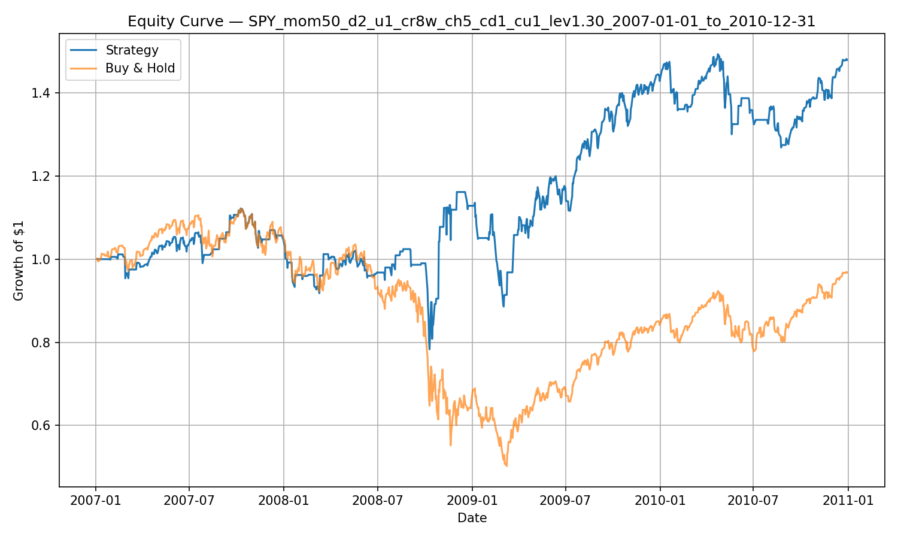

# Stock Backtester — Multi-Regime Strategy (Momentum + Crash Trigger + Adaptive Leverage)

A small Python backtesting engine that:
- downloads historical market data via `yfinance`
- generates strategy exposure (no lookahead)
- simulates daily returns with transaction fees
- exports performance metrics, CSV, and an equity curve plot vs buy & hold

## Strategy (current)
**Multi-regime system**
1) **Momentum regime:** if lookback return > 0 (default: 50 trading days), stay long.
2) **Down regime:** if momentum is not positive, switch to a streak mean-reversion sub-strategy:
   - Buy after N down days in a row (default: 2)
   - Sell after M up days in a row (default: 1)
   - Apply adaptive leverage in this regime (default: 1.3× when long)
3) **Crash trigger:** if the asset drops more than X% over ~1 week (default: 8% over 5 trading days),
   enable a faster streak mode for a short window (default: 5–10 days). By default, leverage is disabled
   during crash mode for safety.

## Example: Global Financial Crisis (2007–2010, SPY)


## Setup
```bash
python -m venv .venv
source .venv/bin/activate
pip install -r requirements.txt

